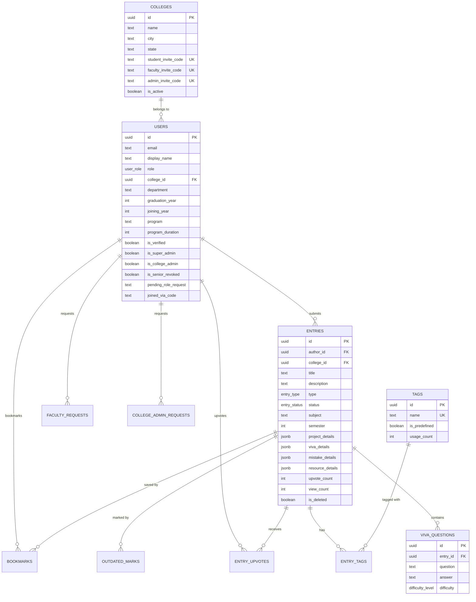

# 🎓 College Knowledge Vault — Complete Project Report

> **A Multi-Tenant Mobile Knowledge Sharing Platform for College Students**
> Built with React Native + Supabase

---

## 📌 1. Project Overview

### 1.1 What is College Knowledge Vault?

College Knowledge Vault (CKV) is a **mobile-first knowledge-sharing platform** where graduating senior students share their academic experiences — project reports, viva questions, common mistakes, and learning resources — with junior students of their college.

### 1.2 Problem Statement

Every year, graduating students leave college taking their valuable academic knowledge with them. Junior students face the same challenges without guidance:
- *"What viva questions were asked?"*
- *"What mistakes should I avoid in my final project?"*
- *"Which resources actually helped?"*

**CKV solves this** by creating a persistent, college-specific knowledge vault that grows richer each year.

### 1.3 Key Objectives

| # | Objective | Status |
|---|-----------|--------|
| 1 | Build a cross-platform mobile app (Android-first) | ✅ Completed |
| 2 | Implement secure Google OAuth authentication | ✅ Completed |
| 3 | Create a role-based access control system (6 roles) | ✅ Completed |
| 4 | Enable 4 types of knowledge submissions | ✅ Completed |
| 5 | Build faculty moderation workflow | ✅ Completed |
| 6 | Implement multi-tenant college isolation | ✅ Completed |
| 7 | Add invite code verification system | ✅ Completed |
| 8 | Support full-text search across entries | ✅ Completed |

---

## 🛠️ 2. Technology Stack

### 2.1 Frontend (Mobile App)

| Technology | Purpose | Version |
|-----------|---------|---------|
| **React Native** | Cross-platform mobile framework | 0.86.0 |
| **TypeScript** | Type-safe JavaScript | 5.8.3 |
| **React Navigation** | Navigation (Stack + Bottom Tabs) | 7.x |
| **Zustand** | Global state management | 5.0.14 |
| **TanStack React Query** | Server state, caching, pagination | 5.101.4 |
| **React Hook Form + Zod** | Form management & validation | 7.82 / 4.4 |
| **MMKV** | Ultra-fast key-value storage | 4.3.2 |
| **Shopify FlashList** | High-performance list rendering | 2.3.2 |

### 2.2 Backend (BaaS)

| Technology | Purpose |
|-----------|---------|
| **Supabase** | PostgreSQL database, Auth, Storage, RLS |
| **Google OAuth** | Social sign-in via Google |
| **Firebase Cloud Messaging** | Push notifications |
| **Supabase Storage** | PDF project report uploads |

### 2.3 Dev & Testing

| Tool | Purpose |
|------|---------|
| **Jest** | Unit & integration testing (494 tests) |
| **React Native Testing Library** | Component rendering tests |
| **ESLint + Prettier** | Code quality & formatting |

### 2.4 Why These Technologies?

```
React Native → Single codebase for Android & iOS, large ecosystem
Supabase    → Open-source Firebase alternative with PostgreSQL, RLS, real-time
Zustand     → Minimal boilerplate vs Redux, excellent TypeScript support
React Query → Automatic caching, background refetch, optimistic updates
MMKV        → 30x faster than AsyncStorage for token persistence
```

---

## 🏗️ 3. System Architecture

### 3.1 High-Level Architecture

```
┌─────────────────────────────────────────────────┐
│                  MOBILE APP                      │
│  React Native 0.86 + TypeScript                  │
│                                                  │
│  ┌──────────┐ ┌──────────┐ ┌─────────────┐      │
│  │  Screens │ │Components│ │ Navigation  │      │
│  └────┬─────┘ └────┬─────┘ └──────┬──────┘      │
│       │            │              │              │
│  ┌────▼────────────▼──────────────▼──────┐       │
│  │         Zustand Store (Auth)          │       │
│  │      TanStack Query (Data Cache)      │       │
│  └────────────────┬──────────────────────┘       │
│                   │                              │
│  ┌────────────────▼──────────────────────┐       │
│  │          Service Layer                │       │
│  │  authService │ entryService │ etc.    │       │
│  └────────────────┬──────────────────────┘       │
└───────────────────┼──────────────────────────────┘
                    │ HTTPS / REST
┌───────────────────▼──────────────────────────────┐
│               SUPABASE CLOUD                      │
│                                                   │
│  ┌──────────┐ ┌───────────┐ ┌─────────────┐      │
│  │ Auth     │ │ PostgreSQL│ │ Storage     │      │
│  │ (Google) │ │ + RLS     │ │ (PDFs)      │      │
│  └──────────┘ └───────────┘ └─────────────┘      │
│                                                   │
│  ┌──────────────────────────────────────┐         │
│  │  Row Level Security (RLS) Policies   │         │
│  │  → Multi-tenant data isolation       │         │
│  └──────────────────────────────────────┘         │
└───────────────────────────────────────────────────┘
```

### 3.2 Folder Structure

```
src/
├── app/                    # App entry point & Navigation
│   └── Navigation.tsx      # Root navigator with auth guards
│
├── core/                   # Core business logic (shared across features)
│   ├── constants/          # App-wide constants
│   ├── hooks/              # Custom React hooks (useEntries, etc.)
│   ├── services/           # API service layer (15 service files)
│   │   ├── authService.ts         # Google OAuth + Supabase auth
│   │   ├── entryService.ts        # CRUD for knowledge entries
│   │   ├── bookmarkService.ts     # Bookmark management
│   │   ├── collegeService.ts      # College CRUD & admin
│   │   ├── commentService.ts      # Entry comments
│   │   ├── moderationService.ts   # Faculty moderation
│   │   ├── notificationService.ts # FCM push notifications
│   │   ├── profileService.ts      # User profile & stats
│   │   ├── inviteCodeService.ts   # College invite code verification
│   │   └── ... (6 more)
│   ├── store/              # Zustand state stores
│   │   └── authStore.ts    # Global auth state
│   ├── types/              # TypeScript interfaces & enums
│   └── utils/              # Utility functions
│       └── roleChecker.ts  # Role computation logic (SSoT)
│
├── features/               # Feature modules (14 modules)
│   ├── auth/               # Login, Landing, Role Selection
│   ├── home/               # Feed, Entry Cards, Subject Browse
│   ├── search/             # Full-text search
│   ├── submitEntry/        # Multi-step submission (4 entry types)
│   ├── profile/            # 6 role-specific profile views
│   ├── dashboard/          # Contribution stats & entries
│   ├── bookmarks/          # Saved entries
│   ├── faculty/            # Faculty moderation queue
│   ├── collegeAdmin/       # College admin panel
│   ├── superAdmin/         # Platform super admin
│   ├── admin/              # Admin home & user management
│   ├── entryDetail/        # Full entry view
│   ├── onboarding/         # First-time user onboarding
│   └── legal/              # Privacy policy
│
├── shared/                 # Shared UI components
│   └── components/         # TagPill, StatusBadge, etc.
│
supabase/
├── schema.sql              # Base database schema
├── rls_policies.sql         # Row Level Security policies
├── COMPLETE_DATABASE_SETUP.sql  # Full production setup
└── migrations/             # 10 incremental migrations
```

---

## 🗄️ 4. Database Schema & Structure

### 4.1 Entity-Relationship Diagram



### 4.2 Database Tables Summary

| # | Table | Purpose | Key Columns |
|---|-------|---------|-------------|
| 1 | `colleges` | Multi-tenant college registry | name, city, invite codes |
| 2 | `users` | User profiles (extends Supabase auth) | role, college_id, is_super_admin |
| 3 | `entries` | Knowledge entries (core content) | type, status, project/viva/mistake/resource details (JSONB) |
| 4 | `tags` | Predefined + custom tags | name, is_predefined, usage_count |
| 5 | `entry_tags` | Many-to-many junction | entry_id, tag_id |
| 6 | `viva_questions` | Individual viva Q&A items | question, answer, difficulty |
| 7 | `entry_upvotes` | User upvote tracking | entry_id, user_id |
| 8 | `bookmarks` | User bookmarks | user_id, entry_id |
| 9 | `outdated_marks` | Community-driven outdated flagging | entry_id, user_id, reason |
| 10 | `faculty_requests` | Faculty verification requests | user_id, status, employee_id |
| 11 | `college_admin_requests` | College admin applications | user_id, college_name, status |
| 12 | `entry_flags` | Content flagging | entry_id, reason, description |

### 4.3 Custom Database Enums

```sql
user_role:       'student' | 'senior' | 'faculty'
entry_type:      'project' | 'viva' | 'mistake' | 'resource'
entry_status:    'pending' | 'approved' | 'rejected'
difficulty_level: 'easy' | 'medium' | 'hard'
frequency_level:  'rare' | 'common' | 'very_common'
flag_reason:      'spam' | 'inappropriate' | 'duplicate' | 'inaccurate' | 'other'
```

### 4.4 Row Level Security (RLS)

RLS ensures **multi-tenant data isolation** at the database level:

| Table | Policy | Who Can Access |
|-------|--------|----------------|
| `entries` SELECT | `entries_select_verified_college` | Authors see own entries; approved entries visible to same-college users; Super Admin sees all |
| `entries` INSERT | `entries_insert_same_college` | Authenticated users who are not senior-revoked |
| `entries` UPDATE | `entries_update_owner_or_moderator` | Entry author OR faculty/admin of same college |
| `users` SELECT | `users_read_all` | All authenticated users |
| `users` UPDATE | `users_update_own` | Own profile OR super admin/college admin |
| `colleges` SELECT | `colleges_read_all` | All authenticated users |

---

## 👥 5. Role-Based Access Control (RBAC)

### 5.1 The 6 Effective Roles

CKV implements a **computed effective role** system. The raw database `role` column stores `student`, `senior`, or `faculty`, but the actual UI permissions are computed from multiple fields:

```
Priority Order (highest to lowest):
1. Super Admin    → is_super_admin = true
2. College Admin  → is_college_admin = true
3. Faculty        → role = 'faculty' AND is_verified = true
4. Pending Faculty → role = 'faculty' AND is_verified = false
5. Senior         → Final-year student (computed from joining_year + program_duration)
6. Student        → Default fallback
```

### 5.2 Role Permissions Matrix

| Feature | Student | Senior | Pending Faculty | Faculty | College Admin | Super Admin |
|---------|---------|--------|-----------------|---------|---------------|-------------|
| Browse entries | ✅ | ✅ | ✅ | ✅ | ✅ | ✅ |
| Search entries | ✅ | ✅ | ✅ | ✅ | ✅ | ✅ |
| Bookmark entries | ✅ | ✅ | ✅ | ✅ | ✅ | ✅ |
| Upvote entries | ✅ | ✅ | ✅ | ✅ | ✅ | ✅ |
| **Submit entries** | ❌ | ✅ | ❌ | ✅ | ✅ | ✅ |
| View Dashboard | ❌ | ✅ | ❌ | ✅ | ✅ | ✅ |
| **Moderate entries** | ❌ | ❌ | ❌ | ✅ | ✅ | ✅ |
| Manage faculty requests | ❌ | ❌ | ❌ | ❌ | ✅ | ✅ |
| Manage users | ❌ | ❌ | ❌ | ❌ | ✅ | ✅ |
| Manage colleges | ❌ | ❌ | ❌ | ❌ | ❌ | ✅ |

### 5.3 Academic Standing Computation

Senior status is **automatically computed** — not manually assigned:

```typescript
function computeAcademicStanding(user) {
  const currentYear = new Date().getFullYear(); // 2026
  const graduationYear = joiningYear + programDuration;
  const currentProgramYear = currentYear - joiningYear + 1;
  
  if (currentProgramYear > programDuration) → "Alumni"
  if (currentProgramYear === programDuration) → "Senior" ✅
  else → "Student"
}

// Example: Joined 2023, 4-year program
// Graduation = 2027, Current year in program = 2026 - 2023 + 1 = 4
// 4 === 4 → SENIOR ✅
```

---

## 🔄 6. Application Workflow

### 6.1 Authentication Flow

```
User Opens App
     │
     ▼
┌─ Onboarding ─┐  (first launch only)
│  3 slides     │
└───────┬───────┘
        ▼
┌─ Landing Screen ─┐
│  Role Portals:    │
│  Student/Faculty/ │
│  College Admin    │
└───────┬───────────┘
        ▼
┌─ Google Sign-In ─┐
│  OAuth → idToken  │
└───────┬───────────┘
        ▼
┌─ Supabase Auth ─────────┐
│  signInWithIdToken()     │
│  → session + access_token│
└───────┬─────────────────┘
        ▼
┌─ Fetch/Create Profile ──┐
│  SELECT from public.users│
│  If not found → upsert   │
│  Auto-detect Super Admin │
└───────┬─────────────────┘
        ▼
    New User? ──Yes──▶ Role Selection Flow
        │                     │
        No                    ▼
        │              Select College
        │              Enter Invite Code
        │              Choose Department
        │              Set Program Details
        ▼                     │
   ┌─ Main App ◀─────────────┘
   │  (Tab Navigator)
   └──────────────
```

### 6.2 Entry Submission Flow

```
Senior/Faculty opens Submit Tab
          │
          ▼
   ┌─ Step 1: Choose Type ─┐
   │  📋 Project Report     │
   │  📝 Viva Questions     │
   │  ⚠️ Common Mistake     │
   │  📚 Resource            │
   └───────┬───────────────┘
           ▼
   ┌─ Type-Specific Form ──────────────────────┐
   │  Project: title, category, team, links,    │
   │           challenges, tips, PDF upload      │
   │  Viva: questions, answers, difficulty       │
   │  Mistake: context, root cause, solution     │
   │  Resource: URL, type, review, difficulty    │
   └───────┬───────────────────────────────────┘
           ▼
   ┌─ Add Tags ────────────┐
   │  Predefined + custom   │
   └───────┬───────────────┘
           ▼
   ┌─ Review & Submit ─────┐
   │  Preview all details   │
   │  Submit → status=pending│
   └───────┬───────────────┘
           ▼
   ┌─ Moderation Queue ────┐
   │  Faculty reviews       │
   │  Approve / Reject      │
   │  Push notification     │
   └───────────────────────┘
```

### 6.3 Faculty Moderation Workflow

```
Faculty opens Review Tab
        │
        ▼
┌─ Pending Entries List ─┐
│  Same college only      │
│  Sorted by date         │
└───────┬────────────────┘
        ▼
┌─ Review Entry ─────────────┐
│  Read full submission       │
│  Check content quality      │
│                             │
│  ┌─── APPROVE ────┐        │
│  │  status→approved│        │
│  │  Notify author  │        │
│  └────────────────┘        │
│                             │
│  ┌─── REJECT ─────┐        │
│  │  Add reason     │        │
│  │  status→rejected│        │
│  │  Notify author  │        │
│  └────────────────┘        │
└─────────────────────────────┘
```

### 6.4 Multi-Tenant College Isolation

```
College A                    College B
┌──────────────┐            ┌──────────────┐
│ Students A   │            │ Students B   │
│ Faculty A    │            │ Faculty B    │
│ Entries A    │            │ Entries B    │
│ Admin A      │            │ Admin B      │
└──────┬───────┘            └──────┬───────┘
       │                           │
       │   RLS enforces isolation  │
       │   at the DATABASE level   │
       ▼                           ▼
┌──────────────────────────────────────────┐
│          Supabase PostgreSQL              │
│  WHERE college_id = user's college_id     │
│  (enforced by RLS, not application code)  │
└──────────────────────────────────────────┘
```

---

## 📱 7. Screen-by-Screen Feature Guide

### 7.1 Navigation Structure

```
Root Navigator
├── Onboarding (3 slides)
├── Landing (Role portals)
├── Login (Google OAuth)
├── Role Selection (multi-step)
├── Pending Access (waiting screen)
│
└── Main Tabs ─────────────────────
    ├── 🏠 Home Tab
    │   ├── Home (entry feed)
    │   ├── Entry Detail
    │   ├── Subject Browse
    │   └── Bookmarks
    │
    ├── 🔍 Search Tab
    │   ├── Search
    │   └── Entry Detail
    │
    ├── ✍️ Submit Tab (Senior/Faculty only)
    │   ├── Project Submission Flow
    │   ├── Viva Submission Flow
    │   ├── Mistake Submission Flow
    │   └── Resource Submission Flow
    │
    ├── 📋 Review Tab (Faculty/Admin only)
    │   └── Faculty Moderation Screen
    │
    ├── 🏛️ College Admin Tab (College Admin only)
    │   └── College Admin Screen
    │
    ├── ⚙️ Admin Tab (Super Admin only)
    │   └── Super Admin Screen
    │
    └── 👤 Profile Tab
        ├── Profile (6 role-specific views)
        ├── Edit Profile
        ├── Dashboard (My Contributions)
        ├── Entry Detail
        ├── Bookmarks
        └── Admin screens
```

### 7.2 Four Entry Types

| Type | Icon | What It Contains |
|------|------|------------------|
| **Project** | 📋 | Project report, team members, GitHub/demo links, challenges, tips, PDF upload |
| **Viva** | 📝 | Subject, semester, questions with answers, difficulty levels |
| **Mistake** | ⚠️ | Context, root cause, how discovered, solution, prevention tips |
| **Resource** | 📚 | URL, resource type, review, difficulty, subjects covered |

---

## 🔐 8. Security Implementation

### 8.1 Authentication Security

| Layer | Implementation |
|-------|---------------|
| **OAuth Provider** | Google Sign-In (no passwords stored) |
| **Token Storage** | MMKV encrypted storage (not AsyncStorage) |
| **Session Management** | Supabase JWT with auto-refresh |
| **Account Deletion** | GDPR-compliant 2-step deletion with "DELETE" confirmation |

### 8.2 Data Security (RLS)

```sql
-- Example: Users can ONLY see entries from their own college
CREATE POLICY "entries_select_verified_college" ON public.entries
  FOR SELECT TO authenticated
  USING (
    is_deleted = false
    AND (
      -- Super Admin sees everything
      EXISTS (SELECT 1 FROM public.users WHERE id = auth.uid() AND is_super_admin = true)
      -- Authors always see their own entries
      OR author_id = auth.uid()
      -- Approved entries visible to same-college users
      OR (
        status = 'approved'
        AND college_id = (SELECT college_id FROM public.users WHERE id = auth.uid())
      )
    )
  );
```

### 8.3 Invite Code System

Each college has 3 unique invite codes:
- **Student Code**: `COLL1A-2026-X4R2` — for student registration
- **Faculty Code**: `COLL1A-FAC-Y7K9` — for faculty onboarding
- **Admin Code**: `COLL1A-ADM-Z3M1` — for college admin setup

---

## 🐛 9. Bugs Encountered & Solutions

### Bug #1: Senior Role Not Persisting After Re-login
**Symptom**: User logged out and back in → showed Student interface instead of Senior.
**Root Cause**: The `computeEffectiveRole()` function was computing academic standing from `joiningYear` and `programDuration`, but these values were sometimes NULL after re-login because the profile fetch didn't always return them.
**Fix**: Added fallback checks in `computeEffectiveRole()` to also check `user.role === 'senior'` as a string match, and improved `computeAcademicStanding()` to fallback to `graduationYear` when joining_year/program_duration are missing.

### Bug #2: Dashboard Showing 0 Contributions
**Symptom**: User submitted a project, but Dashboard showed "0 Total, 0 Entries".
**Root Cause**: RLS policy bug in `007_invite_codes.sql`. The `author_id = auth.uid()` check was **nested inside** the `joined_via_code IS NOT NULL` condition. If the user's `joined_via_code` was NULL, the subquery returned NULL → `college_id = NULL` always false → entire entry selection blocked.
**Fix**: Created migration `010_fix_entries_select_policy.sql` to move `author_id = auth.uid()` to a **top-level OR** condition.

### Bug #3: App Crash — "FontSize should be a positive value: 0"
**Symptom**: Red crash screen with font rendering stack trace when opening Dashboard.
**Root Cause**: Hidden `<Text>` elements used `fontSize: 0` for accessibility hints. Android's text renderer crashes on `fontSize: 0`.
**Fix**: Changed `fontSize: 0` → `fontSize: 1` in `EntryCard.tsx` and `StatusBadge.tsx`.

### Bug #4: `program_type` Column Not Found
**Symptom**: Silent failure during role selection — profile not saved to database.
**Root Cause**: The `completeRoleSelection()` function tried to write to a `program_type` column that didn't exist in the users table. The DB schema used `text` column without enum, but the app was sending the wrong column name.
**Fix**: Removed `program_type` from the primary update fields in `authService.ts`.

### Bug #5: Navigation Crash on "My Submissions"
**Symptom**: Tapping "My Submissions" in Senior profile caused crash / blank screen.
**Root Cause**: `EntryCard` component didn't handle null `entry.type` gracefully, and `SeniorProfileSections` tried to call `.toUpperCase()` on potentially null values.
**Fix**: Added null-safety fallbacks: `(item.type || 'PROJECT').toUpperCase()` and conditional date rendering.

### Bug #6: EditProfile and EntryDetail Screens Not Registered
**Symptom**: Navigating to Edit Profile or Entry Detail from the Profile tab caused a "screen not found" error.
**Root Cause**: These screens were missing from the `ProfileStack.Navigator` registration.
**Fix**: Added `EditProfileScreen` and `EntryDetailScreen` to the Profile stack navigator.

---

## 🧪 10. Testing

### 10.1 Test Summary

```
Test Suites: 55 passed, 55 total
Tests:       494 passed, 494 total
Time:        ~8 seconds
```

### 10.2 Test Categories

| Category | Count | What's Tested |
|----------|-------|---------------|
| **Unit Tests** | ~100+ | Role checker, academic standing, utilities |
| **Service Tests** | ~150+ | Auth, entry CRUD, bookmarks, search, notifications |
| **Component Tests** | ~100+ | EntryCard, Search, Forms, StatusBadge |
| **Integration/Flow Tests** | ~100+ | Submission flow, login flow, moderation |
| **Hook Tests** | ~40+ | useSubmitForm, useEntries |

### 10.3 Key Test Files

```
__tests__/
├── services/
│   ├── authService.bug.test.ts      # Auth edge cases
│   ├── entryService.test.ts         # Entry CRUD
│   ├── entryService.search.test.ts  # Search queries
│   ├── bookmarkService.test.ts      # Bookmarks
│   └── notificationService.test.ts  # Push notifications
├── screens/
│   └── SearchScreen.test.tsx        # Search UI
├── flows/
│   └── submission.test.tsx          # Full submission flow
├── hooks/
│   └── useSubmitForm.comprehensive.test.tsx
├── unit/
│   └── programs.test.ts             # Academic standing
└── utils/                           # Role checker tests
```

---

## 📊 11. Key Algorithms & Logic

### 11.1 Role Computation Algorithm

```typescript
function computeEffectiveRole(user): EffectiveRole {
  // Priority 1: Super Admin
  if (user.isSuperAdmin) return SuperAdmin;
  
  // Priority 2: College Admin
  if (user.isCollegeAdmin) return CollegeAdmin;
  
  // Priority 3: Faculty (verified)
  if (user.role === 'faculty' && user.isVerified) return Faculty;
  
  // Priority 4: Faculty (pending verification)
  if (user.role === 'faculty' && !user.isVerified) return PendingFaculty;
  
  // Priority 5: Senior (explicit role OR academic standing)
  if (user.role === 'senior' && !user.isSeniorRevoked) return Senior;
  
  // Priority 5b: Senior by academic standing
  const standing = computeAcademicStanding(user);
  if (standing.accessLevel === 'senior' && !user.isSeniorRevoked) return Senior;
  
  // Priority 6: Default
  return Student;
}
```

### 11.2 Session Restoration Algorithm

```typescript
async function initializeAuth() {
  // 1. Try restoring session from MMKV
  const restored = await restoreSession();
  
  // 2. Fetch FRESH profile from DB (captures background approvals)
  const latestUser = await getCurrentUser();
  
  // 3. Check for deleted user
  if (user.displayName === 'Deleted User') → reset & logout
  
  // 4. Determine if new user (no college assigned)
  const isNewUser = !user.collegeId && !user.pendingRoleRequest;
  
  // 5. Listen for auth state changes (token refresh, sign out)
  onAuthStateChange((event, session) => { ... });
}
```

### 11.3 Full-Text Search (PostgreSQL)

```sql
-- Searches across entries, viva questions, and tags simultaneously
SELECT * FROM search_vault_entries(
  search_query := 'react native',
  college_filter := '...',
  type_filter := 'project',
  max_results := 20
);
-- Uses ts_rank() for relevance scoring
-- Searches: title, description, questions, tags
```

---

## 📱 12. Key Screens & UI

### 12.1 Profile System (6 Role-Specific Views)

Each role sees a **different** profile interface:

| Role | Profile Sections |
|------|-----------------|
| **Student** | Academic standing bar, progress to Senior, explore categories |
| **Senior** | Contributor stats, Submit CTA, Submissions tracker, revocation alerts |
| **Pending Faculty** | Verification timeline, Check Status, Cancel Request |
| **Faculty** | Moderation stats, Queue shortcut, Guide submission |
| **College Admin** | College metrics, Governance shortcuts |
| **Super Admin** | Platform-wide stats, Root administration |

### 12.2 Submission Form (Multi-Step Wizard)

Each entry type has a **dedicated submission flow**:
- `ProjectSubmissionFlow` — Title, team, links, challenges, PDF
- `VivaSubmissionFlow` — Subject, questions, answers, difficulty
- `MistakeSubmissionFlow` — Context, mistake, cause, solution
- `ResourceSubmissionFlow` — URL, type, review, difficulty

---

## 🔄 13. State Management

### 13.1 Auth State (Zustand)

```typescript
interface AuthState {
  user: User | null;          // Current user profile
  session: Session | null;    // Supabase JWT session
  isAuthenticated: boolean;   // Derived from user presence
  isLoading: boolean;         // True during session restore
  isNewUser: boolean;         // No college assigned yet
  hasOnboarded: boolean;      // Completed onboarding slides
  
  // Role helper methods
  getEffectiveRole(): EffectiveRole;
  canSubmit(): boolean;
  canModerate(): boolean;
}
```

### 13.2 Server State (TanStack React Query)

```typescript
// Infinite scrolling for entry feed
useApprovedEntries({ type, sortBy, department })

// User's own entries for dashboard
useUserEntries(userId)

// Contribution statistics
useUserStats(userId)

// Single entry detail
useEntry(entryId)

// Upvote mutation with optimistic update
useToggleUpvote()
```

---

## 📋 14. Database Migrations History

| # | Migration | Purpose |
|---|-----------|---------|
| 001 | `role_system_fix.sql` | Fix user role enum and default values |
| 002 | `multi_tenant_colleges.sql` | Add colleges table, college_id to users/entries |
| 003 | `program_based_seniority.sql` | Add joining_year, program_duration columns |
| 004 | `fix_users_rls_recursion.sql` | Fix infinite recursion in RLS policies |
| 005 | `additional_features.sql` | Add bookmarks, outdated marks, entry flags |
| 006 | `fix_entries_insert_and_storage.sql` | Fix insert policy, add storage bucket |
| 007 | `account_deletion.sql` | GDPR-compliant account deletion function |
| 007 | `invite_codes.sql` | College invite code system |
| 008 | `full_text_search.sql` | PostgreSQL full-text search functions |
| 009 | `comments.sql` | Entry commenting system |
| 010 | `fix_entries_select_policy.sql` | Fix RLS bug blocking own entry visibility |

---

## ❓ 15. Expected Viva Questions & Answers

### Architecture & Design

**Q1: Why did you choose React Native over Flutter or native Android?**
> React Native allows us to write a single TypeScript/JavaScript codebase that runs on both Android and iOS. We chose it because our team has strong web development skills (React, TypeScript), and the ecosystem has mature libraries for navigation, state management, and testing. React Native 0.86 also has the New Architecture (Fabric, TurboModules) for near-native performance.

**Q2: Why Supabase instead of Firebase?**
> Supabase uses PostgreSQL, which gives us powerful features like Row Level Security (RLS), complex SQL queries, full-text search, and proper relational data modeling with foreign keys. Firebase's NoSQL (Firestore) would have required complex client-side joins and lacked built-in RLS. Supabase also provides the same features (Auth, Storage, Real-time) while being open-source.

**Q3: Explain the difference between Zustand and Redux. Why did you choose Zustand?**
> Zustand is a lightweight state manager (~1KB) with zero boilerplate. Redux requires actions, reducers, middleware, and store configuration. Zustand uses a simple `create()` function with hooks. We chose it because our global state is small (just auth data), and Zustand has excellent TypeScript support without the complexity of Redux Toolkit.

**Q4: What is TanStack React Query and why did you use it?**
> React Query manages "server state" — data that comes from the API. It provides automatic caching, background refetching, pagination, and optimistic updates. Without it, we'd need to manually manage loading states, error states, cache invalidation, and stale data. It separates "what the server has" (React Query) from "what the client knows" (Zustand).

### Database & Security

**Q5: What is Row Level Security (RLS) and how did you implement it?**
> RLS is a PostgreSQL feature that enforces access control at the database level. Every query automatically filters rows based on the authenticated user. For example, our `entries_select` policy ensures users only see entries from their own college, authors can always see their own entries, and super admins see everything. This is more secure than application-level filtering because even if someone bypasses the app, the database itself blocks unauthorized access.

**Q6: How does your multi-tenant architecture work?**
> Each college is a "tenant" with its own data. We use a `college_id` foreign key on both `users` and `entries` tables. RLS policies enforce that queries like `SELECT * FROM entries` automatically filter to `WHERE college_id = current_user's_college_id`. This means College A's students can never see College B's entries, enforced at the database level.

**Q7: How do invite codes work?**
> Each college has 3 unique codes (student, faculty, admin) generated using a combination of college name, UUID hash, and random characters. During registration, users must enter their college's invite code. The code is validated against the `colleges` table, and the user is linked to that college. This prevents unauthorized access to a college's knowledge vault.

**Q8: How do you handle authentication tokens securely?**
> We use MMKV (a high-performance key-value store by WeChat) instead of AsyncStorage. MMKV encrypts data by default on iOS and uses Android's KeyStore for encryption. Supabase JWT tokens are stored in MMKV, and we implement automatic token refresh using Supabase's `onAuthStateChange` listener.

### Role System

**Q9: How does the system determine if a student is a "Senior"?**
> Senior status is computed automatically using the formula: `currentProgramYear = currentYear - joiningYear + 1`. If `currentProgramYear === programDuration`, the student is in their final year and gets Senior access. For example, a student who joined in 2023 with a 4-year program: in 2026, their program year is `2026 - 2023 + 1 = 4`, which equals the duration, so they're a Senior. This is calculated in `computeAcademicStanding()` — never hardcoded.

**Q10: Why do you compute roles instead of just storing them?**
> Because a student's academic standing changes over time without any user action. A 3rd-year student automatically becomes a Senior when the calendar year advances. If we stored the role statically, we'd need a cron job to update all users yearly. By computing it, the role is always accurate in real-time. We also have priority-based resolution: Super Admin > College Admin > Faculty > Senior > Student.

**Q11: Can a Senior's access be revoked?**
> Yes. College Admins can set `is_senior_revoked = true` on a user's profile, which immediately blocks them from submitting entries even though they're in their final year. The revocation banner appears on their profile, and the Submit button is disabled.

### Features & Functionality

**Q12: Explain the content moderation flow.**
> When a Senior submits an entry, it goes into `status = 'pending'`. Faculty members of the same college see it in their Review tab. They can Approve (entry becomes visible to all students) or Reject (with a reason). The author receives a push notification via Firebase Cloud Messaging. Rejected entries show the faculty feedback and an "Edit & Resubmit" button.

**Q13: How does the search feature work?**
> We use PostgreSQL's built-in full-text search with `tsvector` and `tsquery`. The `search_vault_entries()` function searches across entry titles, descriptions, viva questions, and tags simultaneously. Results are ranked by relevance using `ts_rank()`. We also support filtering by entry type, college, and sorting.

**Q14: What are the 4 types of entries and what data does each store?**
> 1. **Project**: Team members, GitHub/demo URLs, challenges, solutions, tips, PDF report upload (stored in Supabase Storage)
> 2. **Viva**: Subject, semester, individual Q&A pairs with difficulty levels (easy/medium/hard)
> 3. **Mistake**: Context (project/lab/viva), root cause, how discovered, solution, prevention tips
> 4. **Resource**: URL, resource type (YouTube/article/course/etc.), paid/free, difficulty, review
> Each type stores its details as a JSONB column in the entries table for flexible schema.

**Q15: How do you handle GDPR-compliant account deletion?**
> We implement a 2-step deletion: Step 1 warns about consequences, Step 2 requires typing "DELETE". The actual deletion: (1) user's display name → "Deleted User", email → "deleted-{uuid}@deleted.vault", (2) avatar cleared, (3) personal data nullified. Knowledge entries remain anonymously in the vault to preserve value for juniors. Supabase RLS prevents the deleted profile from being used to log in.

### Performance & Best Practices

**Q16: How do you handle pagination for the entry feed?**
> We use TanStack React Query's `useInfiniteQuery` hook with cursor-based pagination. The initial load fetches 10 entries. When the user scrolls near the bottom, `fetchNextPage()` loads the next batch. The `getNextPageParam` function checks if the last page had 10 results — if yes, there are more pages. Combined with Shopify's FlashList for virtualized rendering, we maintain 60fps even with hundreds of entries.

**Q17: What testing strategy did you follow?**
> We wrote 494 tests across 55 test suites covering: unit tests for business logic (role computation, academic standing), service tests for all API calls (mocked Supabase), component tests for UI rendering, integration tests for complete user flows (submission, login). We used Jest with React Native Testing Library.

**Q18: What design patterns did you use?**
> - **Feature-based modular architecture**: Each feature (auth, home, search) is self-contained with its own screens, components, and types
> - **Service layer pattern**: All Supabase calls go through service files — screens never call Supabase directly
> - **Single Source of Truth**: `computeEffectiveRole()` in `roleChecker.ts` is the ONLY place role logic lives
> - **Optimistic updates**: Upvotes update the UI immediately before the server confirms

---

## 🚀 16. Future Enhancements

| Feature | Description |
|---------|-------------|
| iOS Support | Deploy to Apple App Store |
| Real-time Updates | Supabase Realtime for live entry feed |
| Analytics Dashboard | Usage charts, popular subjects, trending topics |
| AI-Powered Recommendations | Suggest relevant entries based on student's department/semester |
| Offline Mode | Cache entries locally with MMKV for offline reading |
| Inter-College Sharing | Optional entry sharing between partner colleges |

---

## 📝 17. Conclusion

College Knowledge Vault successfully addresses the problem of academic knowledge loss during student graduation. By combining modern technologies (React Native, Supabase, PostgreSQL RLS), a robust role-based access control system, and a faculty-moderated content pipeline, CKV creates a self-sustaining knowledge ecosystem that grows more valuable with each graduating batch.

**Key Technical Achievements:**
- 6-role computed RBAC with automatic Senior detection
- Multi-tenant college isolation at the database level
- 494 automated tests ensuring reliability
- 4 structured knowledge entry types with rich metadata
- Faculty moderation with push notification workflow
- GDPR-compliant account deletion
- College invite code verification system
- Full-text search across entries, viva questions, and tags

---

*Project by: Hiba Gafoor | Department: Computer Applications | College Knowledge Vault v0.0.1*
